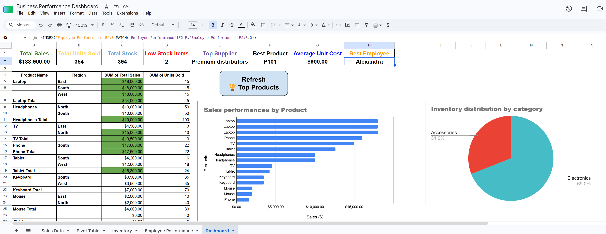
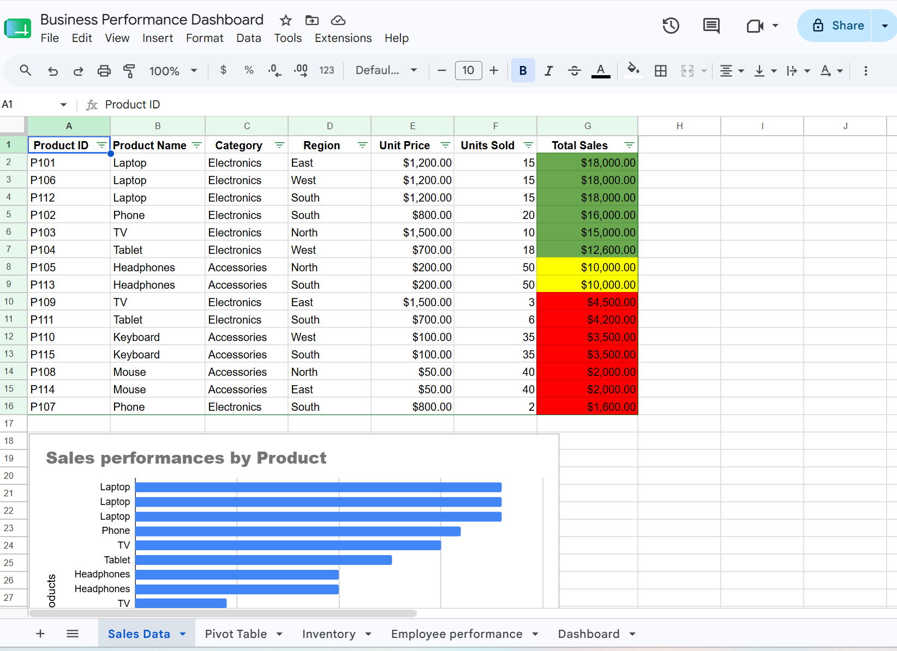
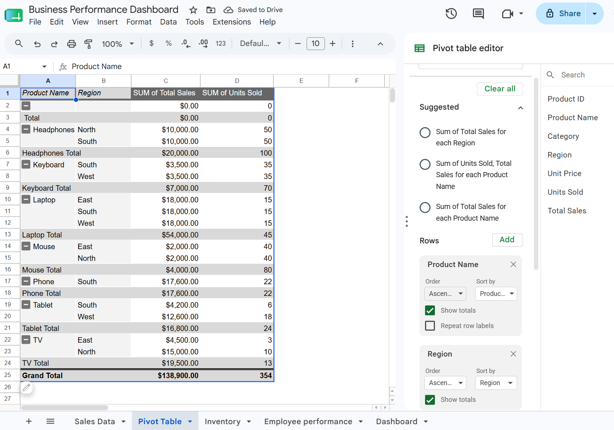
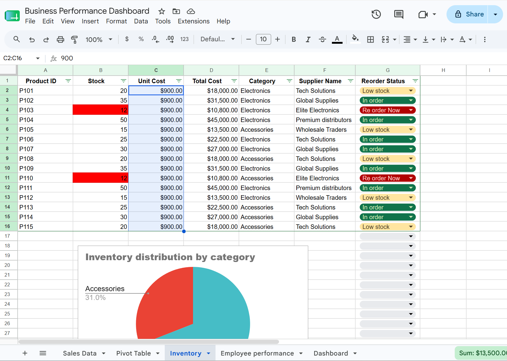
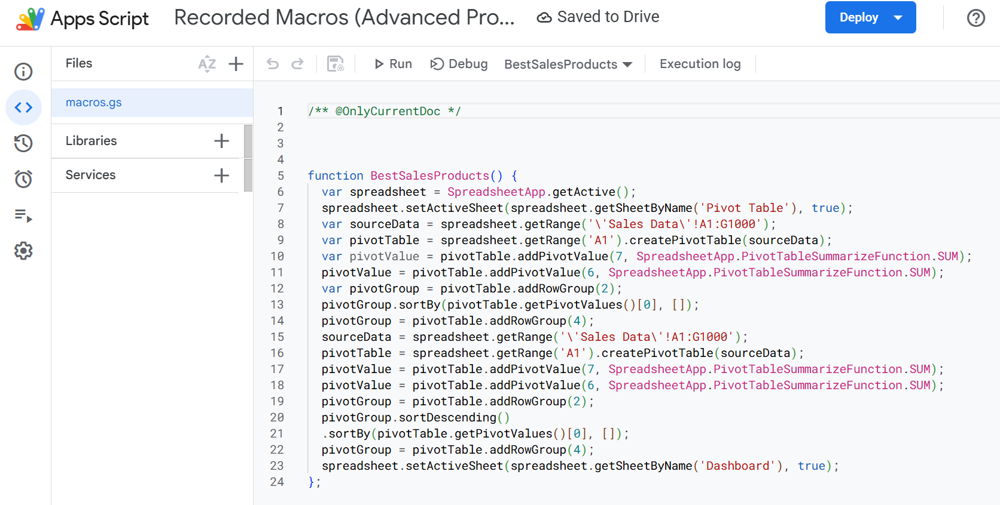

# interactive-business-performance-dashboard-googlesheets
Interactive business dashboard built in Google Sheets for sales, inventory, supplier, and employee performance analysis using pivot tables, formulas, slicers, and Apps Script automation.

# 1) Project Overview

This project is an interactive business dashboard built in Google Sheets to analyze:

- Sales performance
- Inventory management
- Employee performance
- Supplier activity
- Business KPIs

The dashboard combines pivot tables, formulas, slicers, charts, and Apps Script automation to create a dynamic reporting system.

# 2) Features

- Dashboard KPIs
- Total Sales
- Total Units Sold
- Total Stock
- Best Supplier
- Best Product
- Reorder Status Tracking

# 3) Data source

This project was developed using a modified Google Sheets demo dataset. Additional data, dashboard components, KPIs, and automation features were manually added to extend the analysis and improve the reporting system.

# 4) Data Analysis

- Pivot tables for sales and inventory analysis
- Dynamic sorting by highest sales
- Top-performing products analysis
- Employee performance tracking
- Supplier stock analysis

# 5) Automation

- Google Apps Script macros
- Dashboard refresh button
- Automated pivot table generation
- Dynamic sorting

# 6) Interactive Elements

- Slicers
- Charts
- Dropdown menus
- Dashboard buttons

# 7) Tools & Technologies

- Google Sheets
- Pivot Tables
- Apps Script
- QUERY formulas
- INDEX + MATCH formulas
- Data Validation
- Slicers
- Conditional Formatting

# 8) Example KPIs Used

# KPI : Description

- Total Sales	: Total revenue generated
- Total Units : Sold	Number of products sold
- Total Stock	: Remaining inventory
- Best Product : Product with highest sales
- Best Supplier	: Supplier with highest stock
- Reorder Items	: Products needing restock

# 9) Apps Script Example

function TopsalesbybestProduct() {

  var ss = SpreadsheetApp.getActiveSpreadsheet();

  var dashboardSheet = ss.getSheetByName("Dashboard");

  dashboardSheet.clear();

  var sourceData = ss
    .getSheetByName("Sales Data")
    .getRange("A1:G1000");

  var pivotTable = dashboardSheet
    .getRange("A1")
    .createPivotTable(sourceData);

  pivotTable.addRowGroup(2);

  pivotTable.addPivotValue(
    7,
    SpreadsheetApp.PivotTableSummarizeFunction.SUM
  );
}

# 10) Screenshots

# 11) Future Improvements

- More advanced KPI tracking
- Automated email reporting
- Forecasting analysis
- Advanced employee analytics
- Improved UI design
- Google Looker Studio integration

# 12) Author

Created as a data analytics and business dashboard portfolio project using Google Sheets and Apps Script.
